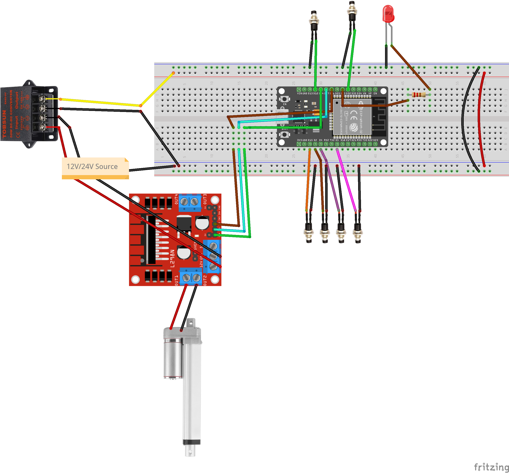

<p align="center">
  <a href="" rel="noopener">
 </a>
</p>

<h3 align="center">Smart Energy Monitoring</h3>

<div align="center">

[]()


</div>

---


<p align="center"> Smart Energy Monitoring
    <br> 
</p>

## 📝 Table of Contents

- [About](#about)
- [Getting Started](#getting_started)
- [Circuit](#circuit)
- [Usage](#usage)
- [WebApp](#webapp)
- [SmartphoneApp](#smartphoneapp)
- [Built Using](#built_using)
- [Authors](#authors)


## 🧐 About <a name = "about"></a>

This repo contains

- Firmware
- Circuit Diagram
- Detailed instructions

for Smart Energy Monitoring.


## Getting Started <a name = "getting_started"></a>

These instructions will get you a copy of the project up and running on your system.


### Prerequisites

Things you need to install the FW.

```
- Arduino IDE
```

### Installing <a name = "installing"></a>

A step by step series that tell you how to get the Firmware and Backend running

#### ESP32 Configuration

You should have Arduino IDE Installed

  1.  Add ESP32 Board to your Arduino IDE
    1. In your Arduino IDE, go to File> Preferences
        Installing ESP32 Add-on in Arduino IDE Windows, Mac OS X, Linux open preferences
    2. Enter ```https://dl.espressif.com/dl/package_esp32_index.json``` 
        into the “Additional Board Manager URLs” field then, click the “OK” button:
        Note: if you already have the ESP32 boards URL, you can separate the URLs with a comma(each board will go to neaw line) as follows:
        ```https://dl.espressif.com/dl/package_esp32_index.json,\n http://arduino.esp8266.com/stable/package_esp8266com_index.json```
    
    
  2. Open the Boards Manager. Go to Tools > Board > Boards Manager…
  3. Search for ESP32 and press install button for the ESP32 by Espressif Systems“:
  4. That’s it. It should be installed after a few seconds.
  5.   In your Arduino sketchbook directory, create tools directory if it doesn't exist yet.
  6.  Unpack the tool into tools directory(present in libs/ESP32FS-1.0.zip) (the path will look like <home_dir>/Arduino/tools/ESP32FS/tool/esp32fs.jar).
  7.  Close and re-open the Arduino IDE.

  8.  Now copy the contents of the libs folder to the libraries directory of your Arduino
      1. If you are using windows, the libraries directory will be Documents/Arduino/libraries

##### ESP32 Node FW Uploading
  1.  Select ESP32 Dev Module from Tools->Board->ESP32
  2.  Select the correct port from Tools->Port
  3.  Then open Firmware.ino file,
  4.  Select Tools > ESP32 Sketch Data Upload menu item. This should start uploading the files into ESP32 flash file system.
  5.  Now Upload the Code to your ESP32 Dev Module.
  6.  Your ESP32 is now ready to be used.


## Circuit <a name = "circuit"></a>


### ESP32 Dev Module Pinout


Follow the pinout diagram given below to connect different components to your TTGO LORA32 board.


### Circuit Diagram for Smart Energy Monitoring

Here's the complete circuit diagram of the system.



### Components Connections

```http
Other components pin connection details
```


#### Buttons

```Buttons Connections with ESP32```

| Buttons Pins | ESP32 Dev Module Pins| 
| :--- | :--- | 
| `BTN1_PIN1` | `12` |
| `BTN2_PIN1` | `32` |
| `BTN3_PIN1` | `15` |
| `BTN4_PIN1` | `2` |
| `BTN5_PIN1` | `4` |
| `BTN6_PIN1` | `5` |


| `ALL BTN PIN2` | `GND` |

#### L298N Pins

```L298N Connections with ESP32```

| L298N Pins | ESP32 Dev Module Pins| 
| :--- | :--- | 
| `ENA` | `14` |
| `IN1` | `27` |
| `IN2` | `26` |

* While OUT1 and OUT2 will be connected to the linear actuator.
* 12V will be connected to the 12V source.

#### Status RGB LED

```LED Connections```

| LED Pins | ESP32 Dev Module | 
| :--- | :--- | 
| `Anode` | `33 via 220Ω resistor` |
| `Cathode` | `GND` |
*33 is also connected to the internal LED of ESP32 Dev Module*


## Usage <a name = "usage"></a>

```diff
! Ready for testing
```
1.  Power on your ESP32, it will present you with an AP named ```SmartJ``` (while ```SmartJ``` can be changed in the portal)
2.  Default captive portal password `12345678AP` which can be changed in captive portal.
3.  Connect to the ESP32 access point and open the web-browser and navigate to the link ```http://smartj.local/_ac```. This link will work on most of the operating systems but if your operating system is not allowing to open it, you may want to check the captive portal IP Address from the serial monitor and can use that IP address inplace of the above mentioned URL.
4.  The default access IP Address is ```http://192.168.4.1/_ac```
5.  You will be presented with a main dashboard as shown below(based on your device)
   

5.  Once connected to a WiFi network, you can again access the captive portal using same URL or the IP Address from the Serial monitor.
6.  The data is published to the MQTT Topic ```smartj/{hostname}``` while the hostname is the one which you can define in Settings page of the captive portal.


### Changing Timezone
```diff
+ Only for developers
```
1.  Open Settings tab
2.  Enter timezone string from https://en.wikipedia.org/wiki/List_of_tz_database_time_zones 'TZ database name' column.
3.  Click Save&Start

### API Endpoints and HTML URLS

```API Endpoints```

| Endpoint | Description | 
| :--- | :--- | 
| `/api-now` | `API: live sensor readings in JSON format` |
| `/api` | `API: sensors data in JSON format` |
| `/LiveSensors` | `HTML PAGE: Live Sensor Data` |
| `/data` | `HTML PAGE: Historical Sensor Data` | 
| `/mqtt_settings` | `HTML PAGE: Settings. Default username: AP Name, Default Password: admin` | 
| `/_ac` | `HTML PAGE: Main Captive portal page` | 
| `/` | `HTML PAGE: Historical Sensor Data` | 


1.  **Connect to WiFi** tab allows searching of nearby WiFi APs and adding them to the ESP32.
   
2.  **Saved WiFi Networks** tab allows connecting to the saved access points.
   
3.  **Reset...** tab allows reseting of the device to factory settings.
    
4.  **Settings** tab contains settings related to MQTT and sensors.
    
5. **HOME** tab shows sensor data acquired live.


## Web App <a name="webapp"></a>
```diff
+ For future use
```
[Dashboard Link: ]()

You can access the webapp with following test acccount credentials

*   Email Address: `test@test.com`
*   Password: `test`

### Dashboard Screenshots

## Smartphone App <a name="smartphoneapp"></a>
```diff
+ For future use
```
[Smartphone App Link: ]()

You can access the Smartphone app with following test acccount credentials

*   Email Address: `test@test.com`
*   Password: `test`

### Smartphone App Screenshots


## List of Components <a name = "list"></a>
```diff
+ For future use; not a comprehensive list
```
Following components are used to make this project

1.  [ESP32 Dev Kit Module](https://www.amazon.com/HiLetgo-ESP-WROOM-32-Development-Microcontroller-Integrated/dp/B0718T232Z/ref=sr_1_3?crid=5EOAXOANUSCU&dchild=1&keywords=esp32+nodemcu&qid=1629587138&sprefix=esp32+node%2Caps%2C201&sr=8-3)

2. [Micro USB Cable](https://www.amazon.com/Android-Charger-sweguard-Charging-Phone-Grey/dp/B09MT18H3J/ref=sr_1_2_sspa?keywords=micro+usb+cable&qid=1661962441&sprefix=micro+usb+%2Caps%2C181&sr=8-2-spons&psc=1&spLa=ZW5jcnlwdGVkUXVhbGlmaWVyPUEzVkw1N1RQVTVHTVA3JmVuY3J5cHRlZElkPUEwODYyODU0MUdBSDQwTjBWVDZVSiZlbmNyeXB0ZWRBZElkPUEwODMyNjQyMVo4WU1VOVQ5UlMzQiZ3aWRnZXROYW1lPXNwX2F0ZiZhY3Rpb249Y2xpY2tSZWRpcmVjdCZkb05vdExvZ0NsaWNrPXRydWU=)

3. [2x Joystick Modules](https://www.amazon.com/Active-Piezo-Buzzer-Module-SunFounder/dp/B014KQLE8Q/ref=sr_1_7?crid=33DTNM1X8SVMH&keywords=joystick%2Bmodule&qid=1660570221&sprefix=joystick%2Bmodule%2Caps%2C175&sr=8-7&th=1)

4. [Jumper Wires](https://www.amazon.com/EDGELEC-Breadboard-Optional-Assorted-Multicolored/dp/B07GD2BWPY/ref=sr_1_1_sspa?crid=1EFHAMLH1TF1Q&keywords=jumper+wires&qid=1661962101&sprefix=jumper+wire%2Caps%2C197&sr=8-1-spons&psc=1&spLa=ZW5jcnlwdGVkUXVhbGlmaWVyPUFHUFdBUzFHMDVOSlUmZW5jcnlwdGVkSWQ9QTAwNTYwNTAyVDNTNFI5RVI4TTNQJmVuY3J5cHRlZEFkSWQ9QTA5NDU0MzYxSkE3VExKQkZEQUxaJndpZGdldE5hbWU9c3BfYXRmJmFjdGlvbj1jbGlja1JlZGlyZWN0JmRvTm90TG9nQ2xpY2s9dHJ1ZQ==)


## ⛏️ Built Using <a name = "built_using"></a>

- [Arduino](https://www.arduino.cc/) - Embedded Framework and IDE - For Sensor Node Design

## 📹 Demo Videos <a name = "demo"></a>
```diff
+ For future use
```
<!-- -   [Device Demo Video]() - Smart Energy Monitorings Device Demo Video -->

## ✍️ Authors <a name = "authors"></a>

- [@Nauman3S](https://github.com/Nauman3S) - Development and Deployment
