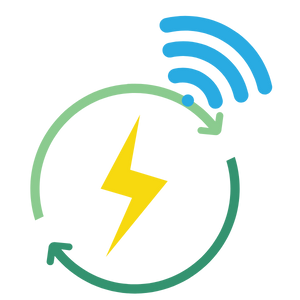
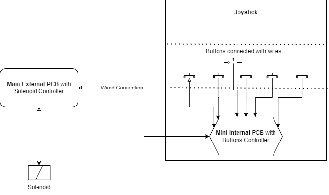
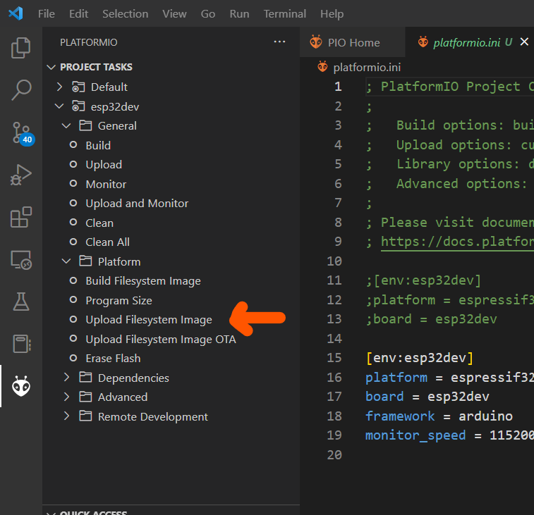
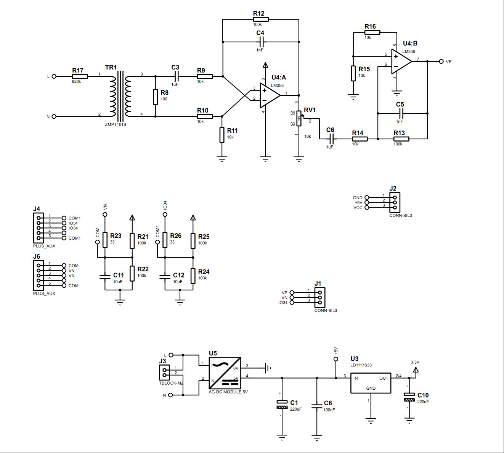
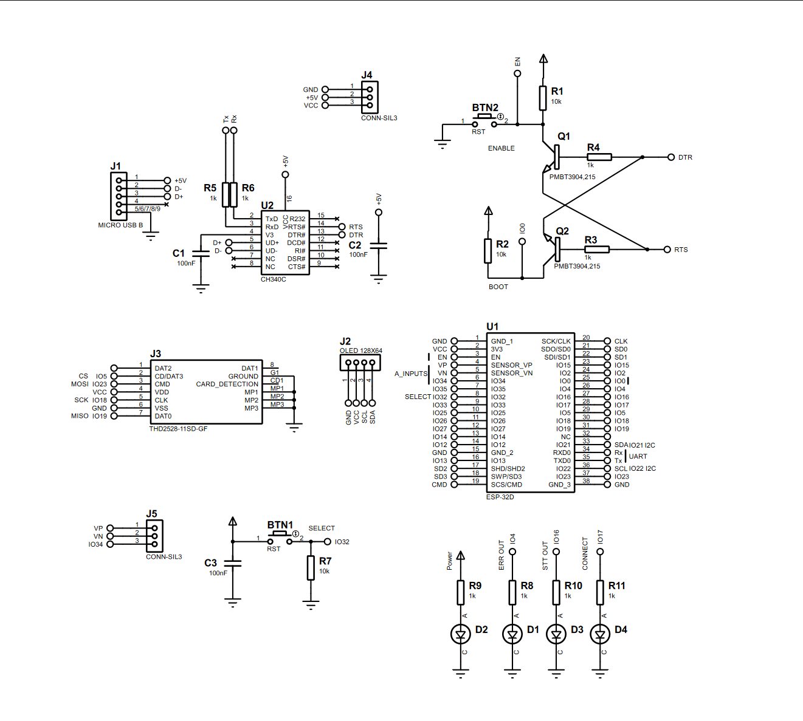
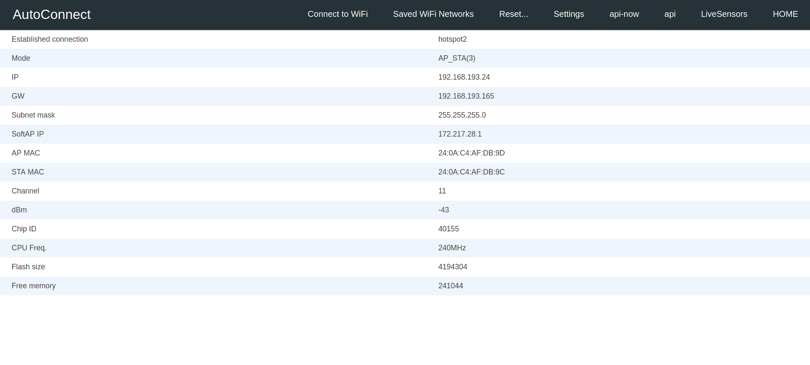
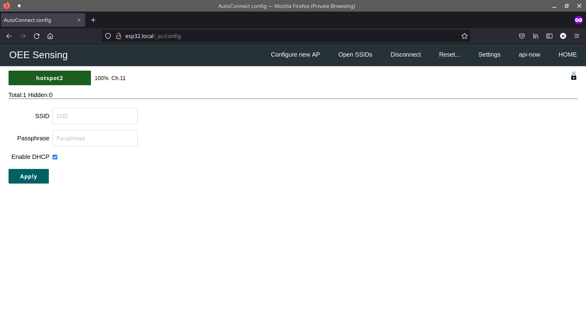
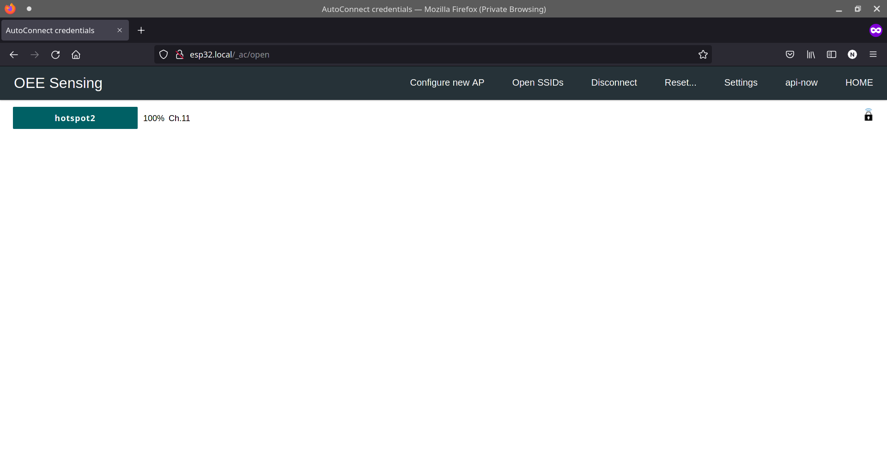
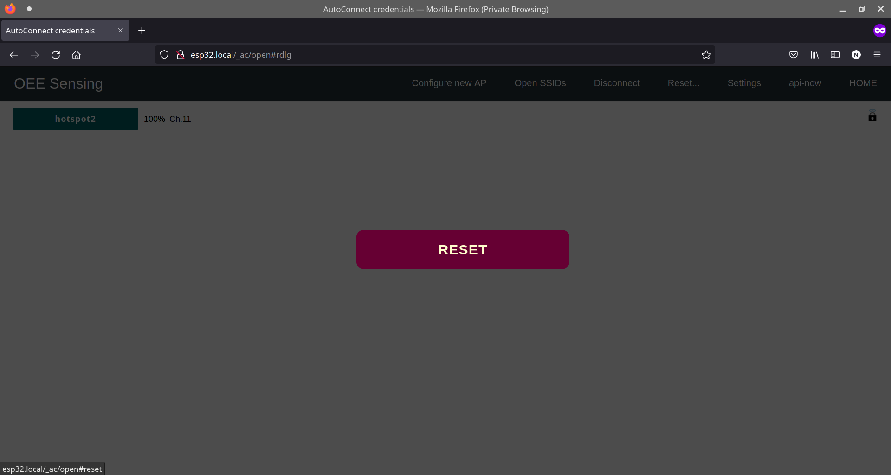
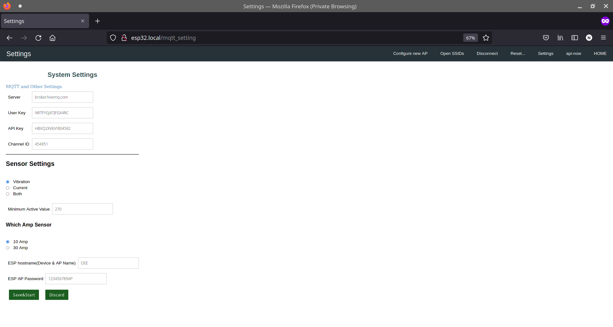

<p align="center">
  <a href="" rel="noopener">
 </a>
</p>

<h3 align="center">Smart Energy Monitoring</h3>

<div align="center">

[]()


</div>

---


<p align="center"> Smart Energy Monitoring
    <br> 
</p>

## 📝 Table of Contents

- [About](#about)
- [Getting Started](#getting_started)
- [Circuit](#circuit)
- [Usage](#usage)
- [WebApp](#webapp)
- [Built Using](#built_using)
- [Authors](#authors)


## 🧐 About <a name = "about"></a>

This repo contains

- Firmware
- Circuit Diagram
- Detailed instructions

for Smart Energy Monitoring.





## Getting Started <a name = "getting_started"></a>

These instructions will get you a copy of the project up and running on your system.


### Prerequisites

Things you need to install the FW.

```
- Platform.io
```

### Installing <a name = "installing"></a>

A step by step series that tell you how to get the Firmware and Backend running

#### ESP32 Configuration and Firmware Uploading

You should have Platform.io Installed

  1.  Add ESP32 Board to your Platform.io
  
  2. Open `Firmware` folder in VSCode with Platform.io
  3. On the right side-bar click on Platform.io button
  4. Click on `Upload Filesystem Image` to upload the SPIFFS data.
  
  5.  Now upload the code to your esp32.


## Circuit <a name = "circuit"></a>


### ESP32 Dev Module Pinout


Follow the pinout diagram given below to connect different components to your ESP32 board.


### Schematics for Smart Energy Monitoring

Here's the complete circuit diagram of the system.




### Components Connections

```http
Other components pin connection details
```


#### LEDs

```Buttons Connections with ESP32```

| LED Pins | ESP32 Dev Module Pins| 
| :--- | :--- | 
| `LED1` | `4` |
| `LED2` | `16` |
| `LED3` | `17` |

| `ALL LED PIN2` | `GND` |

#### Voltage Sensor Pins

```ZMPT101B Connections with ESP32```

| ZMPT101B Pins | ESP32 Dev Module Pins| 
| :--- | :--- | 
| `OUT` | `VP(36)` |

#### Current Sensor Pins

```Current Connections with ESP32```

| Current Pins | ESP32 Dev Module Pins| 
| :--- | :--- | 
| `Sensor 1_PIN1` | `IO34` |
| `Sensor 2_PIN1` | `VN(IO39)` |


## Usage <a name = "usage"></a>

```diff
! Ready for testing
```
1.  Power on your ESP32, it will present you with an AP named ```smartbde``` (while ```smartbde``` can be changed in the portal)
2.  Default captive portal password `12345678AP` which can be changed in captive portal.
3.  Connect to the ESP32 access point and open the web-browser and navigate to the link ```http://smartbde.local/_ac```. This link will work on most of the operating systems but if your operating system is not allowing to open it, you may want to check the captive portal IP Address from the serial monitor and can use that IP address inplace of the above mentioned URL.
4.  The default access IP Address is ```http://192.168.4.1/_ac```
5.  You will be presented with a main dashboard as shown below(based on your device)
   

5.  Once connected to a WiFi network, you can again access the captive portal using same URL or the IP Address from the Serial monitor.
6.  The data is published to the MQTT Topic ```smartbde/{hostname}``` while the hostname is the one which you can define in Settings page of the captive portal.


### Changing Timezone
```diff
+ Only for developers
```
1.  Open Settings tab
2.  Enter timezone string from https://en.wikipedia.org/wiki/List_of_tz_database_time_zones 'TZ database name' column.
3.  Click Save&Start

### API Endpoints and HTML URLS

```API Endpoints```

| Endpoint | Description | 
| :--- | :--- | 
| `/api-now` | `API: live sensor readings in JSON format` |
| `/api` | `API: sensors data in JSON format` |
| `/LiveSensors` | `HTML PAGE: Live Sensor Data` |
| `/data` | `HTML PAGE: Historical Sensor Data` | 
| `/mqtt_settings` | `HTML PAGE: Settings. Default username: AP Name, Default Password: admin` | 
| `/_ac` | `HTML PAGE: Main Captive portal page` | 
| `/` | `HTML PAGE: Historical Sensor Data` | 


1.  **Connect to WiFi** tab allows searching of nearby WiFi APs and adding them to the ESP32.
   
2.  **Saved WiFi Networks** tab allows connecting to the saved access points.
   
3.  **Reset...** tab allows reseting of the device to factory settings.
    
4.  **Settings** tab contains settings related to MQTT and sensors.
    
5. **HOME** tab shows sensor data acquired live.


## Web App <a name="webapp"></a>
```diff
+ For future use
```
[Dashboard Link: ]()

You can access the webapp with following test acccount credentials

*   Email Address: `test@test.com`
*   Password: `test`

### Dashboard Screenshots


## List of Components <a name = "list"></a>

Following components are used to make this project

1.  ESP32
2.  ZMPT101B
3.  LEDs
4.  2x CT-013-000

## ⛏️ Built Using <a name = "built_using"></a>

- [Arduino](https://www.arduino.cc/) - Embedded Framework and IDE - For Sensor Node Design


## ✍️ Authors <a name = "authors"></a>

- [@Nauman3S](https://github.com/Nauman3S) - Development and Deployment
